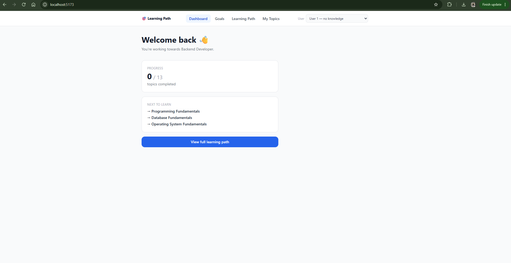
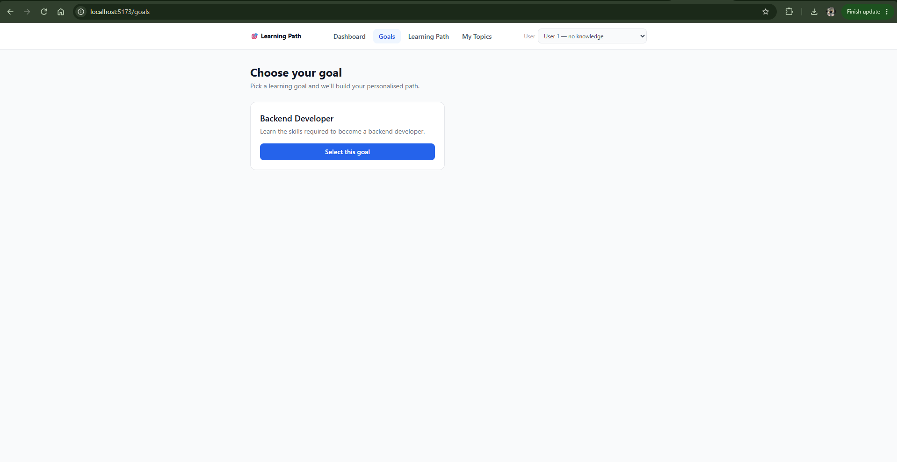
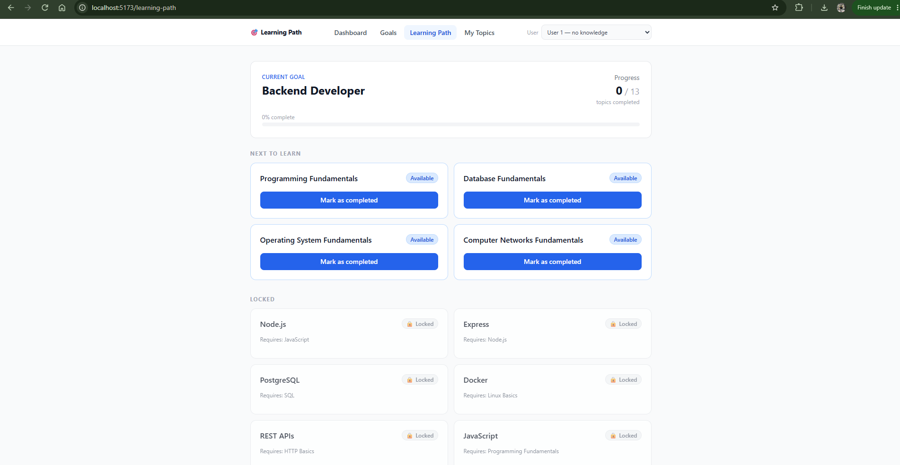
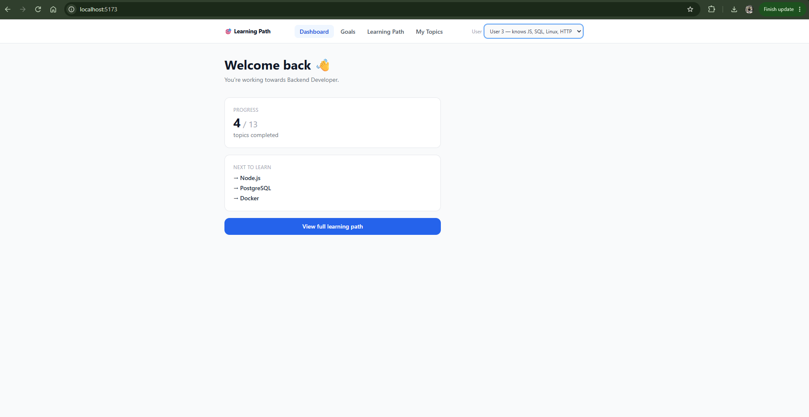
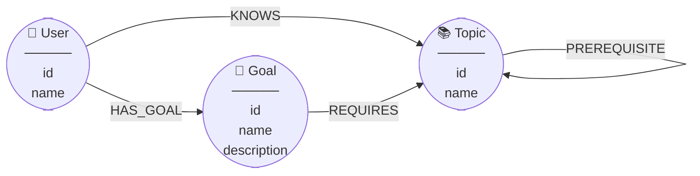

# Learning Path — Graph-Powered Skill Tracker

A full-stack web application that models a learning curriculum as a **directed graph** in CognoDB (a hosted, Neo4j-compatible graph database). The app computes each learner's personalised path through the dependency graph in real time: which topics are done, which are unlocked, and which are still blocked by missing prerequisites.

---

## Screenshots

### Dashboard


### Goals


### Learning Path


### My Topics


---

## Use Case

A learner wants to become a **Backend Developer** but does not know what order to learn things in. The application:

1. Represents the goal as a node connected to required topic nodes via `REQUIRES` edges.
2. Represents prerequisite relationships between topics as `PREREQUISITE` edges.
3. Traverses the entire dependency graph from the goal to find every topic the learner needs.
4. Computes per-topic status from the user's `KNOWS` relationships: **completed**, **available** (all prerequisites done), or **locked** (at least one prerequisite missing).
5. Lets the learner mark a topic as completed; the path recomputes immediately.
6. Shows exactly which prerequisites are blocking each locked topic.

---

## Why a Graph Database?

The prerequisite structure is a **directed acyclic graph (DAG)**: a topic can be a prerequisite of multiple other topics (JavaScript is a prerequisite of both Node.js and Express), and paths through the graph can be of arbitrary depth.

A relational database can model this with a self-referencing `prerequisites` table and recursive CTEs. That works, but the graph model offers a better conceptual fit:

| Aspect | Relational | Graph (CognoDB) |
|---|---|---|
| Prerequisite relationships | Self-join table + recursive CTE | First-class `PREREQUISITE` edges |
| Variable-depth traversal | `WITH RECURSIVE` CTE | `[:PREREQUISITE*0..]` in one Cypher clause |
| Shared prerequisites | Duplicate rows or explicit deduplication | One shared node referenced by multiple edges |
| Adding a new dependency level | Same schema, query complexity grows | Add an edge — query unchanged |
| Reading the data model | Tables and foreign keys imply relationships | Nodes and edges express them directly |

Cypher makes the traversal concise. The query that discovers the full dependency graph is a few lines rather than a recursive CTE. Shared nodes (e.g. JavaScript) are represented once in the graph — completing that topic automatically satisfies the prerequisite for every topic that depends on it, with no application-level deduplication.

---

## Data Model

### Entity diagram



### Relationships

| Relationship | From | To | Meaning |
|---|---|---|---|
| `HAS_GOAL` | User | Goal | The learner is pursuing this goal |
| `KNOWS` | User | Topic | The learner has completed this topic |
| `REQUIRES` | Goal | Topic | The goal directly requires this topic |
| `PREREQUISITE` | Topic | Topic | This topic must be completed before the other |

### Seeded dependency graph

The structure is a DAG. JavaScript is a **shared node** — it is a prerequisite of Node.js, and Node.js is a prerequisite of Express.

```
Goal: Backend Developer
│
├─ REQUIRES ──► Node.js
│                  └─ PREREQUISITE ──► JavaScript  ◄─── shared node
│                                          └─ PREREQUISITE ──► Programming Fundamentals
│
├─ REQUIRES ──► Express
│                  └─ PREREQUISITE ──► Node.js  (same node as above)
│
├─ REQUIRES ──► PostgreSQL
│                  └─ PREREQUISITE ──► SQL
│                                          └─ PREREQUISITE ──► Database Fundamentals
│
├─ REQUIRES ──► Docker
│                  └─ PREREQUISITE ──► Linux Basics
│                                          └─ PREREQUISITE ──► Operating System Fundamentals
│
└─ REQUIRES ──► REST APIs
                   └─ PREREQUISITE ──► HTTP Basics
                                           └─ PREREQUISITE ──► Computer Networks Fundamentals
```

13 topics total across five dependency chains.

---

## Architecture

```
┌──────────────────────┐     REST/JSON     ┌──────────────────────┐
│  React + Vite        │ ── /api/... ────► │  Express + Node.js   │
│  Tailwind CSS        │ ◄─ JSON ───────── │  TypeScript          │
│  React Router        │                   │                      │
└──────────────────────┘                   └──────────┬───────────┘
        :5173                                          │ Bolt 5 (bolt+s://)
                                                       ▼
                                            ┌──────────────────────┐
                                            │  CognoDB Cloud       │
                                            │  Neo4j-compatible    │
                                            │  graph database      │
                                            └──────────────────────┘
```

Request flow: `Route → Controller → Service → Repository → CognoDB`

- **Repositories** own all Cypher queries and manage driver sessions.
- **Services** contain business logic (status computation, error mapping).
- **Controllers** are thin: extract params, delegate to service, send response.
- **Routes** declare endpoints and attach Zod validation middleware.

---

## Project Structure

```
learning_path_Assessment/
├── backend/
│   └── src/
│       ├── config/         # Neo4j driver initialisation
│       ├── controllers/    # Thin HTTP handlers
│       ├── errors/         # AppError, NotFoundError, ValidationError
│       ├── middleware/     # errorHandler, validateBody, validateParams
│       ├── repositories/   # All Cypher queries
│       ├── routes/         # Express routers with validation
│       ├── scripts/        # seed.ts
│       ├── services/       # Business logic
│       ├── types/          # Shared TypeScript interfaces
│       └── app.ts          # Express app (no server.listen — kept separate for testability)
├── frontend/
│   └── src/
│       ├── api/            # goalApi, learningPathApi, userApi (centralised fetch layer)
│       ├── components/     # Reusable UI components
│       ├── context/        # UserContext (demo user switcher)
│       ├── pages/          # DashboardPage, GoalsPage, LearningPathPage, TopicsPage
│       └── types/          # Frontend type definitions mirroring API contracts
├── docs/screenshots/       # Add UI screenshots here
└── README.md
```

---

## Setup

### Prerequisites

- Node.js 18 or later
- npm 9 or later
- A CognoDB account (free tier is sufficient)

### 1 — Create a CognoDB instance

1. Sign up at [console.cognodb.com/signup](https://console.cognodb.com/signup) — no credit card required.
2. Click **New instance**, choose a region, and select the free **c0** tier. It provisions in under a minute.
3. Copy the **Connection URI** (`bolt+s://db-<id>.databases.cognodb.com`) and the **Password** shown on the credentials screen. **The password is shown only once** — save it before leaving the page.
4. The username is always `cognodb`.

### 2 — Clone and install

```bash
git clone <repo-url>
cd learning_path_Assessment

cd backend && npm install
cd ../frontend && npm install
```

### 3 — Configure environment variables

**`backend/.env`** (copy from `backend/.env.example`):

```env
COGNODB_URI=bolt+s://db-<your-instance-id>.databases.cognodb.com
COGNODB_USERNAME=cognodb
COGNODB_PASSWORD=<your-password>
PORT=3000
```

**`frontend/.env`** (copy from `frontend/.env.example`):

```env
VITE_API_URL=http://localhost:3000/api
```

Both `.env` files are in `.gitignore` and must never be committed.

### 4 — Seed the database

```bash
cd backend
npm run seed
```

This clears the graph and creates the full demo dataset (see [Seed Data](#seed-data)).

### 5 — Run

```bash
# Terminal 1 — Backend API
cd backend
npm run dev
# Connected to the database successfully!
# Server running on port 3000

# Terminal 2 — Frontend
cd frontend
npm run dev
# ➜ Local: http://localhost:5173
```

Open [http://localhost:5173](http://localhost:5173). Use the **User** dropdown in the top-right corner to switch between the three demo users.

---

## Environment Variables

| Variable | File | Description |
|---|---|---|
| `COGNODB_URI` | `backend/.env` | CognoDB Bolt URI (`bolt+s://...`) |
| `COGNODB_USERNAME` | `backend/.env` | CognoDB username (always `cognodb`) |
| `COGNODB_PASSWORD` | `backend/.env` | CognoDB instance password |
| `PORT` | `backend/.env` | Express server port (default `3000`) |
| `VITE_API_URL` | `frontend/.env` | Backend base URL for API calls |

---

## Seed Data

`backend/src/scripts/seed.ts` clears the graph and recreates:

**Users**

| ID | Name | Pre-seeded knowledge |
|---|---|---|
| `u1` | User 1 | None (clean slate) |
| `u2` | User 2 | JavaScript, SQL |
| `u3` | User 3 | JavaScript, SQL, Linux Basics, HTTP Basics |

**Goal:** `g1` — Backend Developer

**Topics (13):** Programming Fundamentals, JavaScript, Node.js, Express, Database Fundamentals, SQL, PostgreSQL, Operating System Fundamentals, Linux Basics, Docker, Computer Networks Fundamentals, HTTP Basics, REST APIs

All three users have a `HAS_GOAL → g1` relationship and will see a valid learning path immediately after seeding.

---

## API Reference

| Method | Endpoint | Description |
|---|---|---|
| `GET` | `/api/goals` | List all goals |
| `GET` | `/api/users/:userId/learning-path` | Learning path with per-topic status |
| `POST` | `/api/users/:userId/goals` | Set user's goal — body: `{ "goalId": "g1" }` |
| `POST` | `/api/users/:userId/topics/:topicId/known` | Mark a topic as completed |
| `DELETE` | `/api/users/:userId/topics/:topicId/known` | Unmark a topic as completed |

All route parameters are validated with Zod. Missing or empty params return `400`. Unknown users or goals return `404`.

---

## Main Cypher Queries

### 1. Get user's active goal

```cypher
MATCH (u:User {id: $userId})-[:HAS_GOAL]->(g:Goal)
RETURN g
```

One relationship traversal. Returns no rows if the user has not selected a goal.

---

### 2. Get user's known topics

```cypher
MATCH (u:User {id: $userId})-[:KNOWS]->(t:Topic)
RETURN t
```

---

### 3. Build the full dependency graph — core query

```cypher
MATCH (g:Goal {id: $goalId})-[:REQUIRES]->(required:Topic)
OPTIONAL MATCH (required)-[:PREREQUISITE*0..]->(dep:Topic)
WITH collect(DISTINCT required) + collect(DISTINCT dep) AS allTopics
UNWIND allTopics AS topic
WITH DISTINCT topic
OPTIONAL MATCH (topic)-[:PREREQUISITE]->(prereq:Topic)
WITH topic, collect(prereq) AS prereqs
RETURN
  topic.id       AS topicId,
  topic.name     AS topicName,
  [p IN prereqs | {id: p.id, name: p.name}] AS directPrerequisites
```

**Clause-by-clause:**

| Clause | Purpose |
|---|---|
| `MATCH (g)-[:REQUIRES]->(required)` | Finds the topics the goal directly requires |
| `OPTIONAL MATCH (required)-[:PREREQUISITE*0..]->(dep)` | Variable-length traversal — walks the prerequisite chain to any depth. `*0..` includes the starting node (0 hops), ensuring required topics are also in `dep` |
| `collect(DISTINCT required) + collect(DISTINCT dep)` | Unions both sets into one list of every topic reachable from the goal |
| `UNWIND … WITH DISTINCT topic` | Flattens the list; `DISTINCT` removes duplicates caused by shared nodes appearing via multiple paths (e.g. JavaScript is reachable from both the Node.js and Express subtrees) |
| `OPTIONAL MATCH (topic)-[:PREREQUISITE]->(prereq)` | Fetches only the **direct** prerequisites of each topic (one hop) for lock-status computation |
| `collect(prereq)` | `collect` ignores `null` from `OPTIONAL MATCH` — topics with no prerequisites return an empty list naturally |
| `[p IN prereqs \| {id: p.id, name: p.name}]` | Maps Neo4j Node objects to plain maps for the JSON response |

---

### 4. Set user goal (atomic swap)

```cypher
MATCH (u:User {id: $userId}), (g:Goal {id: $goalId})
OPTIONAL MATCH (u)-[r:HAS_GOAL]->(:Goal)
DELETE r
WITH u, g
MERGE (u)-[:HAS_GOAL]->(g)
RETURN g
```

Removes any existing `HAS_GOAL` edge and creates the new one in a single transaction. Returns no rows if the user or goal node does not exist — the service layer maps this to `404`.

---

## Learning Path Algorithm

### Status rules

| Status | Condition |
|---|---|
| `completed` | User has a `KNOWS` relationship to the topic |
| `available` | Not completed **and** every direct prerequisite is completed |
| `locked` | Not completed **and** at least one direct prerequisite is not completed |

A topic with no prerequisites evaluates to `available` (JavaScript's `Array.prototype.every` on an empty array returns `true`).

### Division of responsibility

**CognoDB** handles graph traversal: finding every topic in the dependency graph and returning each topic's direct prerequisites.

**Backend service layer** handles status computation: builds a `Set` of the user's known topic IDs, then computes the status of each topic in a single pass. This keeps Cypher simple and makes the business logic independently testable.

```typescript
const knownSet = new Set(knownTopics.map(t => t.id));

topics = allTopics.map(topic => {
  if (knownSet.has(topic.id))                          → status: "completed"
  else if (topic.prerequisites.every(p => knownSet.has(p.id))) → status: "available"
  else                                                  → status: "locked"
});
```

---

## Testing

```bash
# Backend (Vitest) — 44 tests, 6 suites
cd backend
npm test
npm run test:coverage

# Frontend (Vitest + React Testing Library) — 37 tests, 6 suites
cd frontend
npm test
npm run test:coverage
```

No live CognoDB instance is required. Backend tests mock the Neo4j driver session via `vi.hoisted`; frontend tests mock the `fetch` API.

**Backend suites:** repositories (mocking driver), services (mocking repositories), routes (mocking services via supertest).

**Frontend suites:** API layer (mocking `fetch`), Nav component, Dashboard, Goals, LearningPath, Topics pages.

---

## Code Coverage

Measured numbers from the actual test run. Coverage artifacts are excluded from the repository via `.gitignore`.

### Backend

| Metric | Measured |
|---|---|
| Statements | 92.26% |
| Branches | 96.00% |
| Functions | 89.47% |
| Lines | 92.44% |

`src/config/database.ts` reports 0% because it initialises the Neo4j driver at import time; it is not excluded from the report but is intentionally untested in unit tests (requires a live connection).

### Frontend

| Metric | Measured |
|---|---|
| Statements | 98.58% |
| Branches | 93.57% |
| Functions | 92.10% |
| Lines | 98.58% |

`src/App.tsx` (root mount) and `src/types/index.ts` (type-only, compiles to nothing) are excluded from the frontend coverage configuration.

---

## Design Decisions

**One shared Neo4j driver** — The driver manages a connection pool internally. It is created once at startup (`config/database.ts`) and shared across all repositories.

**Business logic in the service layer** — Status computation (`completed / available / locked`) depends on the intersection of the dependency graph with a specific user's known topics. Keeping this in TypeScript makes it straightforward to test without a database.

**`app.ts` separate from `index.ts`** — The Express app is exported from `app.ts` without calling `listen`. This lets route integration tests import the app directly without starting the server or connecting to CognoDB.

**Zod validation at the route layer** — Request bodies and route parameters are validated before reaching controllers, so services can assume valid input.

---

## Future Improvements

- **Authentication** — Replace the demo user switcher with real accounts.
- **Multiple goals** — Allow a user to pursue more than one learning path.
- **Learning resources** — Attach URLs, books, or videos to Topic nodes as properties or linked nodes.
- **Estimated time** — Add a `durationHours` property to topics; compute total remaining learning time.
- **Cycle detection** — Add a guard in the seed/admin layer to prevent prerequisite cycles in the graph.
- **Completion timestamps** — Store when each topic was completed as a property on the `KNOWS` relationship.

---